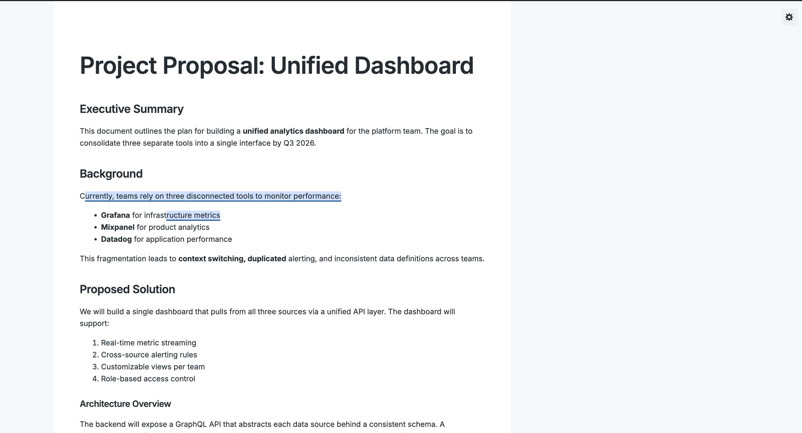
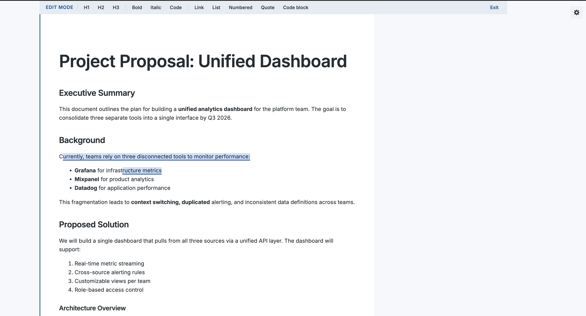
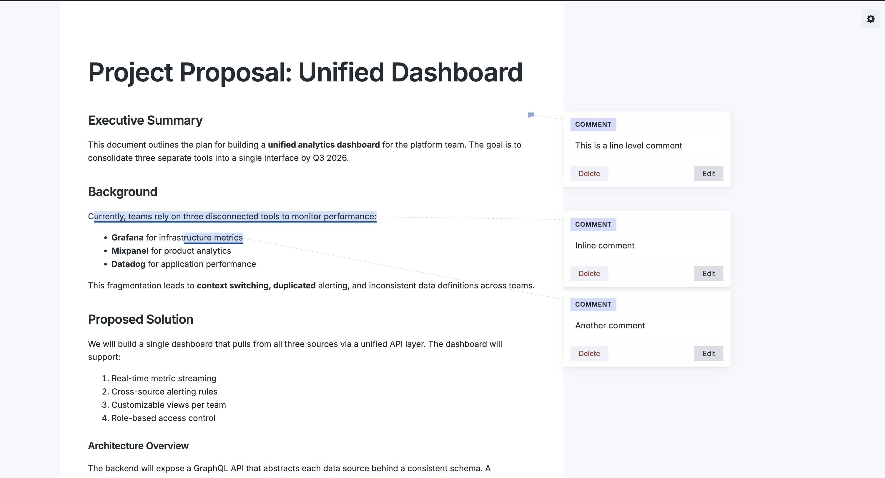
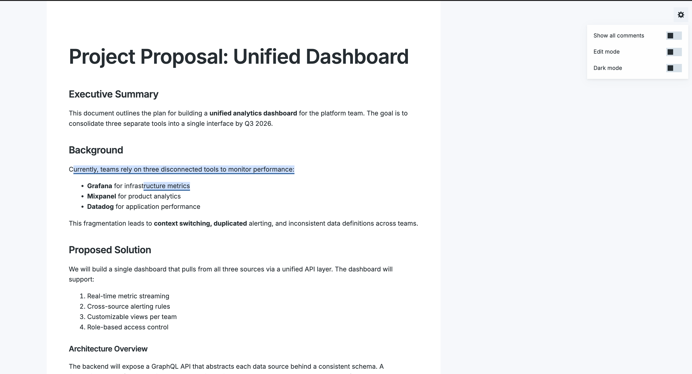

# Markdown Pro — Preview, Comment, Edit — All in One Place

The missing link in AI-assisted writing workflows. Preview, inline-edit, and annotate any Markdown file with comments — then hand it back to an AI agent to address every note. All without leaving VS Code.


## Why This Exists

AI agents increasingly produce their output as Markdown — reports, documentation, plans, code specs. Reviewing that output means context-switching out of VS Code or resorting to clunky copy-paste loops.

**Markdown Pro** keeps the entire review loop inside the file:

1. **AI writes** a Markdown document
2. **You open it** in Markdown Pro — live preview with full formatting
3. **You edit inline** using the WYSIWYG editor, or **leave comments** on specific words, sentences, or sections
4. **You pass the file back** to the AI agent: *"Address all the comments in this file"*
5. **The AI reads your comments**, makes targeted edits, and removes the resolved annotations
6. Repeat until the document is exactly what you need

Comments are stored as standard HTML comment tags inside the `.md` file itself, so they are invisible to Markdown renderers but fully readable by any AI model.

```markdown
## Executive Summary

AI agents are transforming how teams produce written content.
<!-- MC:{"id":"c1","anchor":"transforming","comment":"Too vague — cite a specific metric or example"} -->

This approach reduces iteration time significantly.
<!-- MC:{"id":"c2","anchor":"","comment":"Needs a concrete number here. What does 'significantly' mean?"} -->
```

Pass that file to any AI with: *"Read the `<!-- MC: -->` comments and address each one in place."* The model sees every annotation in full context and can surgically update just the flagged content.

## Features

### Live Markdown Preview

Open any `.md` file and get a rendered preview with full formatting — headings, lists, code blocks, blockquotes, images, and links — all styled with the Inter typeface.



### WYSIWYG Inline Editing

Double-click any paragraph to enter edit mode. A formatting toolbar appears at the top with controls for:

- **Headings** (H1, H2, H3)
- **Text formatting** (Bold, Italic, Inline Code)
- **Links**
- **Lists** (Bulleted and Numbered)
- **Blockquotes**
- **Code blocks**

Edits are written back to the underlying `.md` file as Markdown when you exit edit mode.



### Inline Comments via Text Selection

Select any text in the preview and click the floating **Add Comment** button to attach a comment. The commented text is highlighted in yellow.

### Line-Level Comments

Click any paragraph or block element to add a comment anchored to that line. A speech bubble icon marks the comment location.


### Right-Aligned Comment Sidebar

All comments appear in a sidebar to the right of the content, each aligned to the exact line it annotates. When comments are close together, they stack automatically with a dotted connector line showing which line each belongs to.



### Settings Panel

Click the gear icon in the top-right corner to access the settings panel with three toggles:

| Setting | What it does |
|---------|-------------|
| **Show all comments** | Pins all comment cards open simultaneously — useful for reviewing an entire document at a glance or screenshotting annotated output |
| **Edit mode** | Activates the WYSIWYG editor so you can click anywhere to start editing |
| **Dark mode** | Switches the preview to a dark theme (persists across sessions) |



### Portable, AI-Readable Storage

Comments live directly in your `.md` file as HTML comment tags — invisible in any standard Markdown renderer, but plain text for AI models:

```markdown
<!-- MC:{"id":"c1","anchor":"important details","comment":"Needs a citation"} -->
```

No sidecar files. No proprietary formats. The file is the source of truth.

## Getting Started

### Install from the Extensions Marketplace

1. Open VS Code
2. Press `Cmd+Shift+X` (macOS) or `Ctrl+Shift+X` (Windows/Linux) to open the Extensions panel
3. Search for **Markdown Pro Commenter**
4. Click **Install**

Or install directly from the command line:

```bash
code --install-extension amartyakhan.markdown-pro-commenter
```

### Open a Markdown File

When you open a `.md` file, VS Code will offer **Markdown Commenter** as an editor option.

To set it as the default editor for Markdown files:

1. Right-click any `.md` file in the Explorer
2. Select **Open With...**
3. Choose **Markdown Commenter**
4. Click **Set as Default**

You can also open the commenter from:
- The comment icon in the editor title bar
- Right-click context menu in the Explorer or editor

## Usage

### Adding a Comment on Selected Text

1. Select text in the preview
2. Click the **Add Comment** button that appears below the selection
3. Type your comment
4. Press `Enter` or click **Save**

### Adding a Comment on a Line

1. Click anywhere on a paragraph (without selecting text)
2. Type your comment in the form that appears
3. Press `Enter` or click **Save**

### Editing Content Inline

1. Double-click a paragraph to enter edit mode
2. Use the formatting toolbar or type directly
3. Click **Exit** or click outside the content area to save

### Keyboard Shortcuts

| Action | Shortcut |
|--------|----------|
| Save comment | `Enter` |
| New line in comment | `Shift+Enter` |
| Cancel | `Escape` |

### Reviewing with AI

Once you have annotated a document, pass it to any AI agent or chat interface with a prompt like:

> *"This Markdown file contains inline review comments formatted as `<!-- MC:{...} -->` HTML tags. Please address each comment, make the appropriate edits to the surrounding text, and remove the comment tags once resolved."*

Claude, ChatGPT, Gemini, and most other models handle this natively — they read the raw Markdown including the comment tags and can act on each one in context.

### Editing the Source Directly

Since comments are stored in the `.md` file, you can also edit or remove them in any text editor:

```
<!-- MC:{"id":"c1","anchor":"selected text","comment":"your comment"} -->
```

## Requirements

- Visual Studio Code 1.85.0 or later

## License

[MIT](LICENSE)
