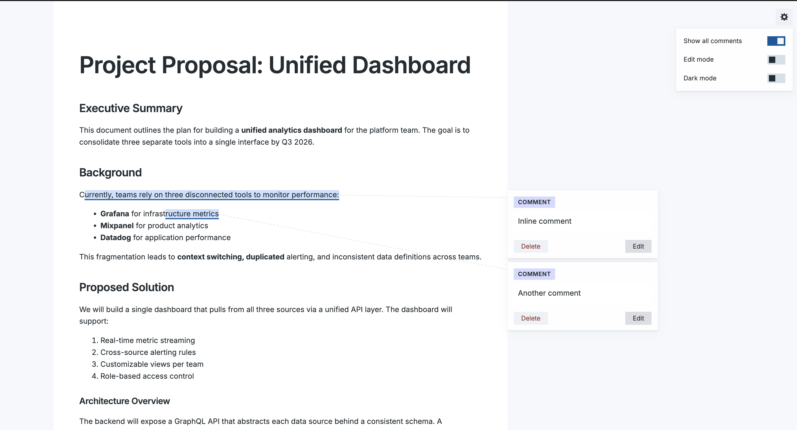
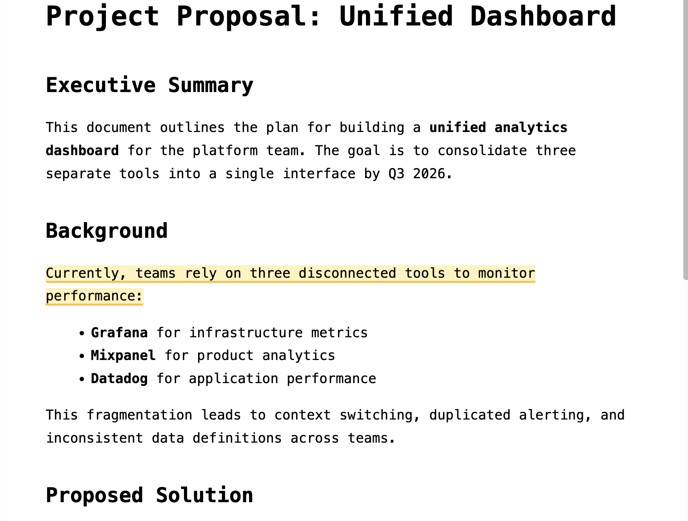
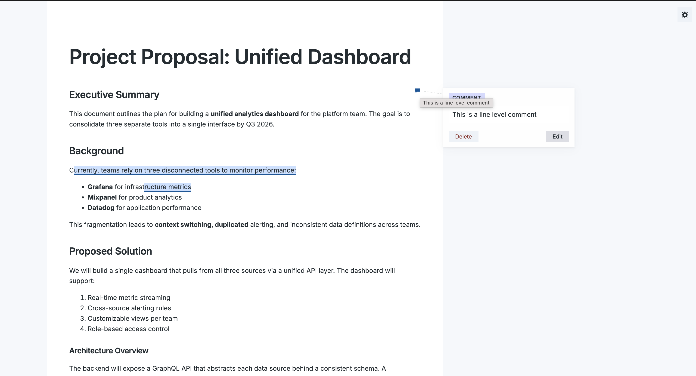
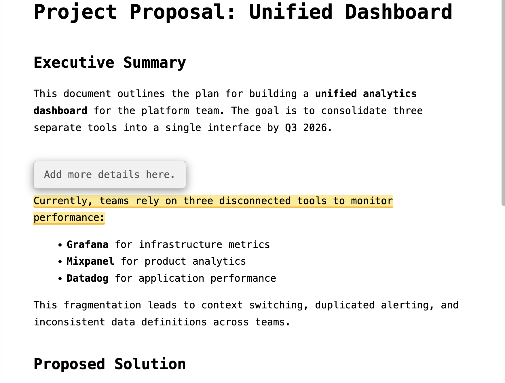
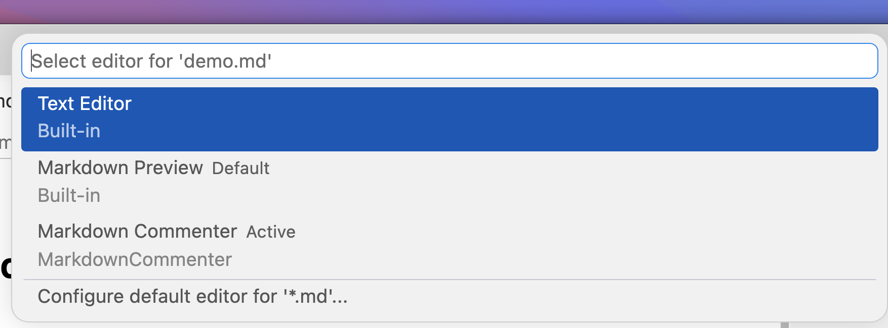

# MarkdownCommenter

A Visual Studio Code extension that lets you add inline comments to Markdown files directly in a live preview.

Comments are stored as HTML comment tags inside the `.md` file itself, keeping everything portable and self-contained.



## Features

### Inline Comments via Text Selection

Select any text in the preview and click the floating "Add Comment" button to attach a comment. The commented text is highlighted in yellow.



### Line-Level Comments

Click any paragraph or block element to add a comment anchored to that line. A speech bubble icon marks the comment location.



### Hover Tooltips

Hover over any highlighted text or comment marker to see the comment content in a tooltip.



### Portable Comment Storage

Comments are stored as standard HTML comments directly in your `.md` file:

```markdown
# My Document

This is a paragraph with important details.
<!-- MC:{"id":"c1","anchor":"important details","comment":"Needs a citation"} -->

Another paragraph here.
<!-- MC:{"id":"c2","anchor":"","comment":"Consider removing this section"} -->
```

HTML comments are invisible in any standard Markdown renderer, so your files remain clean when viewed elsewhere.

## Getting Started

### Install from the Extensions Marketplace

1. Open VS Code
2. Press `Cmd+Shift+X` (macOS) or `Ctrl+Shift+X` (Windows/Linux) to open the Extensions panel
3. Search for **MarkdownCommenter**
4. Click **Install**

Or install directly from the command line:

```bash
code --install-extension amartyakhan.markdown-commenter
```

### Install from VSIX

1. Download `markdown-commenter-0.0.1.vsix`
2. In VS Code, press `Cmd+Shift+P` (macOS) or `Ctrl+Shift+P` (Windows/Linux)
3. Run **Extensions: Install from VSIX...**
4. Select the downloaded `.vsix` file

### Open a Markdown File

When you open a `.md` file, VS Code will offer **Markdown Commenter** as an editor option.

To set it as the default editor for Markdown files:

1. Right-click any `.md` file in the Explorer
2. Select **Open With...**
3. Choose **Markdown Commenter**
4. Click **Set as Default**



You can also open the commenter from:
- The comment icon in the editor title bar
- Right-click context menu in the Explorer or editor

## Usage

### Adding a Comment on Selected Text

1. Select text in the preview
2. Click the **Add Comment** button that appears below the selection
3. Type your comment
4. Press `Enter` or click **Save**

### Adding a Comment on a Line

1. Click anywhere on a paragraph (without selecting text)
2. Type your comment in the form that appears
3. Press `Enter` or click **Save**

### Keyboard Shortcuts

| Action | Shortcut |
|--------|----------|
| Save comment | `Enter` |
| New line in comment | `Shift+Enter` |
| Cancel | `Escape` |

### Viewing Comments

Hover over any yellow-highlighted text or speech bubble icon to see the comment.

### Editing the Source

Since comments are stored in the `.md` file, you can also edit or remove them directly in a text editor. Each comment follows this format:

```
<!-- MC:{"id":"c1","anchor":"selected text","comment":"your comment"} -->
```

## Requirements

- Visual Studio Code 1.85.0 or later

## License

[MIT](LICENSE)
